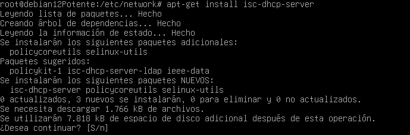
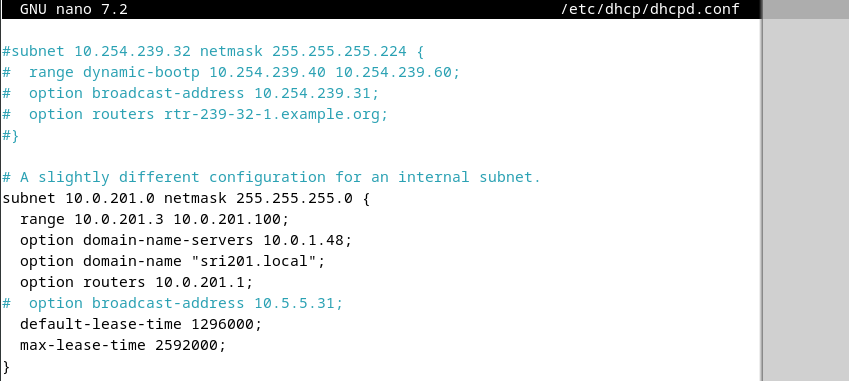
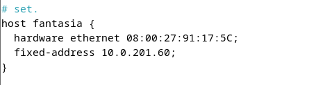
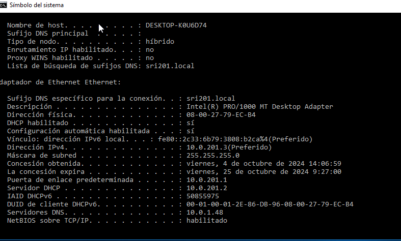
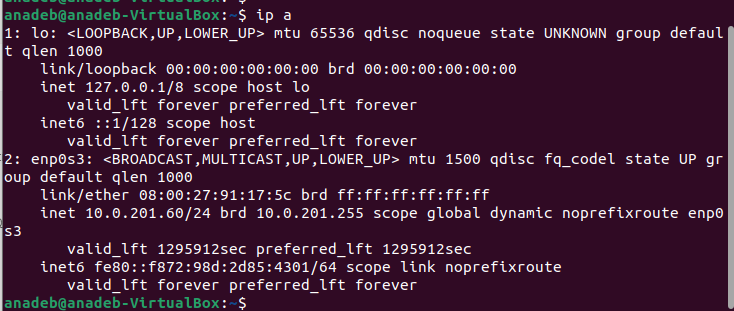
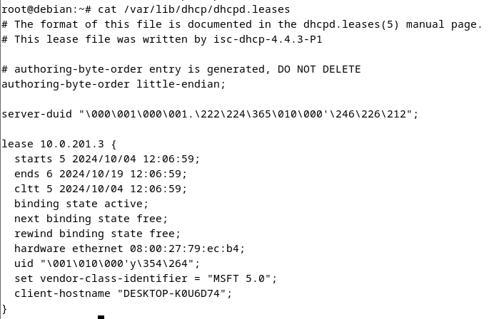

# TAREA 2 ALBERTO CAMACHO ARISTAYETA 

Lo primero que haremos sera instalar en un servidor debian el servicio de DHCP

---

ahora lo que haremos sera configurar el fichero dhcpd.conf para asignar las direcciones de red que queremos que de 

en esta imagen podemos ver el rango de la ips que va a asignar, empieza desde la 10.0.201.3 ya que la 1 y la 2 las tienen de forma estatica tanto el servidor debian como el pfsense. Tambien podemos observar el dns de nuestra maquina real y el tiempo de list-time y  de max-time

---

ahora tendremos que hacer una exclusion de la ip 10.0.201.60 para que se la de al cliente ubuntu 

---

ahora haremos un restart del servicio para guardar y que se apliquen los cambios 

---

ahora llega el momento de probar los clientes, tanto en un cliente ubuntu como en un cliente windows

CLIENTE WINDOWS:

CLIENTE UBUNTU:

aqui vemos que la reserva de ip ha funcionado correctamente

por ultimo veremos las concesiones de ip del servidor de ubuntu 

aqui vemos que le ha asignado la ip a windows; la ip de ubuntu no sale debido a que es una reserva.